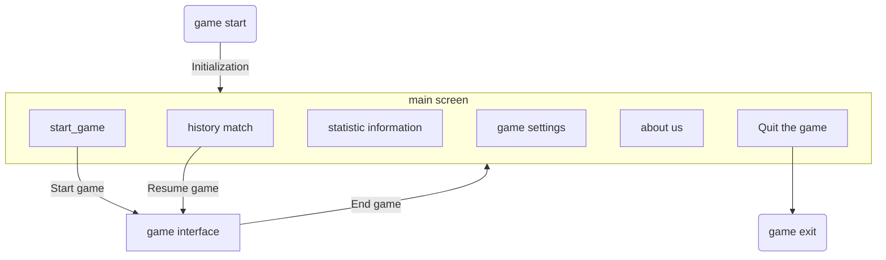

# pyGobang Project Report

Author：Jesse Senior

## 0 Brief description of the project

Project name: pyGobang
Project goal: to implement a sophisticated futsal mini-game based on python.

Specifically, the project needs to meet the following requirements.

1. support two-player matchmaking and human-computer matchmaking
2. record matchmaking records
3. a friendly interactive interface

## 1 Project Planning

### 1.0 Technology Stack

The game uses pygame as the graphics engine and sqlite to record historical games.

The game currently uses Monte Carlo Search Trees (MCTS) for the human-computer part of the game, and will be optimized opportunistically later.

### 1.1 Module Function Planning

| Module Name | Function                                                                                                                                           |
| :---------- | :------------------------------------------------------------------------------------------------------------------------------------------------- |
| constants   | The game constants section.                                                                                                                        |
| core        | The core code section of the game, which contains the definition of the board classes and the logic to determine the winning and losing positions. |
| database    | The database interaction section, which is responsible for maintaining the history of the game.                                                    |
| players     | The human-computer interaction part, which is responsible for the logic abstraction and AI implementation of two-player and human-computer games.  |
| main        | The main function of the game, responsible for initializing the game interface, switching, exiting and starting the message loop.                  |
| display     | The GUI part, including the drawing of the board and pieces, and message passing.                                                                  |
| - tool      | Other utility functions of the GUI, such as image format conversion.                                                                               |
| - texture   | The GUI texture module, responsible for background texture generation.                                                                             |
| - effect    | GUI effect module, responsible for interface animation effect implementation.                                                                      |
| - widget    | GUI component.                                                                                                                                     |
| - screen    | GUI main interface.                                                                                                                                |

### 1.2 Game interface planning

### 1.3 GUI Underlay Planning

Since pygame itself does not provide a top-level module similar to MFC or Qt, components such as buttons, input boxes, text boxes, lists, etc. need to be designed independently.

In order to ensure easy maintenance and scalability of the project, the GUI part will be designed in an object-oriented way, as shown in the figure 😉 !

### 1.4 Human-Machine Adversarial Algorithm Planning

Original code reference: <https://github.com/junxiaosong/AlphaZero_Gomoku>

The original project library is mainly oriented towards training AlphaZero algorithm. This project was initially prepared to use AlphaZero algorithm, but due to board size limitation and arithmetic power requirements, it was finally decided to settle for the second best and use MCTS algorithm. The following judgments are based on.

> **Tips for training:**
>
> 1. It is good to start with a 6 \* 6 board and 4 in a row. For this case, we may obtain a reasonably good model within 500~1000 self-play games in about 2 hours.
> 2. For the case of 8 \* 8 board and 5 in a row, it may need 2000~3000 self-play games to get a good model, and it may take about 2 days on a single PC.
>
> _Reference: <https://github.com/junxiaosong/AlphaZero_Gomoku#getting-started>_

MCTS is based on the standard game tree, but unlike the common minimax algorithm, MCTS is able to maintain some balance between the exploitation of deep variants and the exploration of a few simulated moves, and thus has higher power than the plain minimax algorithm for the same arithmetic power.

Each cycle of Monte Carlo tree search consists of four steps.

- Selection: Starting from the root node R, the game tree is continuously selected down to the leaf node L. A method for selecting children is given below, allowing the game tree to expand in the optimal direction, which is the essence of Monte Carlo tree search.
- Expansion: Create one or more child nodes and select one of them, C, unless the game ends at L due to a win or loss on either side.
- Simulation: The game is played with a random strategy starting from node C. It is also called playout or rollout.
- Backpropagation: Using the result of the random game, the node information on the path from C to R is updated.

After repeating the loop enough times, a better strategy is obtained.

### 1.5 External dependency module planning

| Module Name | Usage |
| ----------- | -------------------- |
| pygame | The main GUI API |
| numpy | Fast storage of board information |
| pillow | Background texture handling |
| pyinstaller | Packaging projects into binary files |
| sqlite | Database interaction |
| pickle | Decode and encode board binary data |

## 2 Project progress

- [x] Core part of the code.
- [x] Database interaction code.
- [x] Human-computer code.
- [ ] Fix **all** bugs (just kidding, almost fixed w(ﾟ Д ﾟ)w
- Graphical interface part.
  - [x] Everyone versus everyone, human versus human.
  - [x] History search, restore, delete.
  - [x] Statistics.
  - [x] Game settings.
  - [ ] Game sound effects, background music.
  - [ ] Game animation effects.
