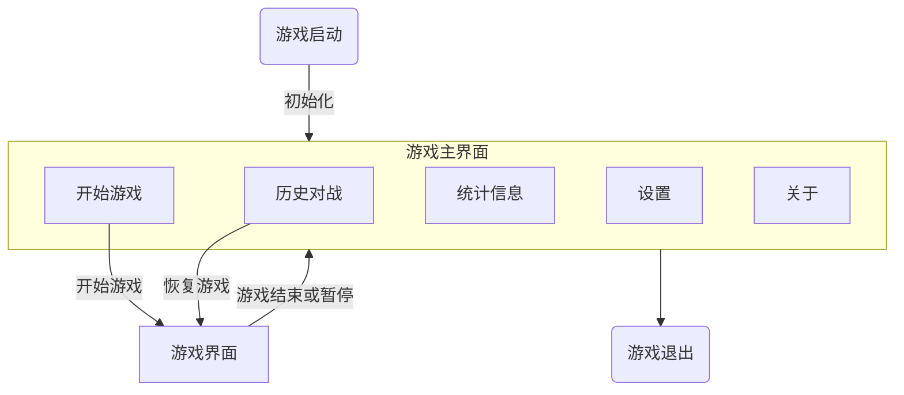

# pyGobang 项目设计报告

作者：Jesse Senior

## 0 项目简述

项目名：pyGobang
项目目标：基于python实现一个精致的五子棋小游戏。

具体而言，项目需要满足以下要求：

1. 支持双人对战、人机对战
2. 记录对战记录
3. 友好的交互界面

## 1 项目规划

### 1.0 技术栈

项目选择使用pygame作为游戏引擎，sqlite作为棋局数据库。

人机对战部分使用蒙特卡洛搜索树(MCTS)。

字体使用开源字体[Sarasa-Mono-SC-Nerd](https://github.com/laishulu/Sarasa-Mono-SC-Nerd)。

### 1.1 模块功能规划

| 模块名    | 功能                                                         |
| :-------- | :----------------------------------------------------------- |
| constants | 游戏常量部分。                                               |
| core      | 游戏核心代码部分，包含棋盘类的定义以及胜负局面的逻辑判断。   |
| database  | 数据库交互部分，负责历史棋局的维护。                         |
| players   | 人机交互部分，负责双人对战、人机对战的逻辑抽象以及AI的实现。 |
| main      | 游戏主函数，负责游戏界面初始化、切换、退出以及启动消息循环。 |
| display   | GUI部分，包含棋盘、棋子的绘制以及消息传递。                  |
| - tool    | GUI其他实用函数，比如图像格式转换。                          |
| - texture | GUI纹理模块，负责背景纹理生成。                              |
| - effect  | GUI效果模块，负责界面动画效果具体实现。                      |
| - widget  | GUI组件。                                                    |
| - screen  | GUI主要界面。                                                |

### 1.2 游戏界面规划

