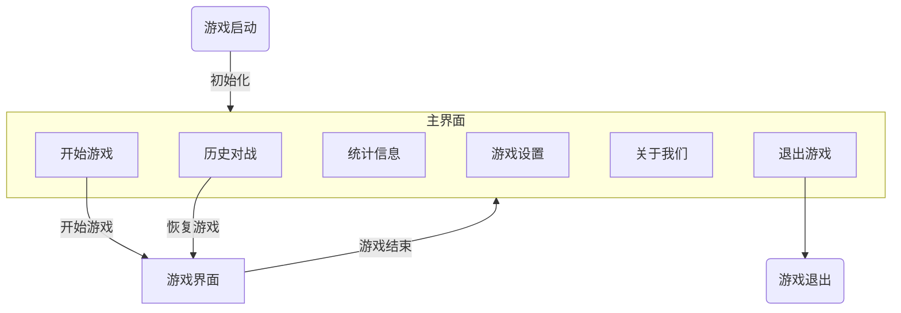

# pyGobang 项目设计报告

作者：Jesse Senior

## 0 项目简述

项目名：pyGobang
项目目标：基于python实现一个精致的五子棋小游戏。

具体而言，项目需要满足以下要求：

1. 支持双人对战、人机对战
2. 记录对战记录
3. 友好的交互界面

## 1 项目规划

### 1.0 技术栈

项目选择使用pygame作为游戏引擎，sqlite作为棋局数据库。

人机对战部分使用蒙特卡洛搜索树(MCTS)。

字体使用开源字体[Sarasa-Mono-SC-Nerd](https://github.com/laishulu/Sarasa-Mono-SC-Nerd)。

### 1.1 模块功能规划

| 模块名    | 功能                                                         |
| :-------- | :----------------------------------------------------------- |
| constants | 游戏常量部分。                                               |
| core      | 游戏核心代码部分，包含棋盘类的定义以及胜负局面的逻辑判断。   |
| database  | 数据库交互部分，负责历史棋局的维护。                         |
| players   | 人机交互部分，负责双人对战、人机对战的逻辑抽象以及AI的实现。 |
| main      | 游戏主函数，负责游戏界面初始化、切换、退出以及启动消息循环。 |
| display   | GUI部分，包含棋盘、棋子的绘制以及消息传递。                  |
| - tool    | GUI其他实用函数，比如图像格式转换。                          |
| - texture | GUI纹理模块，负责背景纹理生成。                              |
| - effect  | GUI效果模块，负责界面动画效果具体实现。                      |
| - widget  | GUI组件。                                                    |
| - screen  | GUI主要界面。                                                |

### 1.2 游戏界面逻辑

### 1.3 人机对抗算法规划

原始代码参考：<https://github.com/junxiaosong/AlphaZero_Gomoku>

原始项目库主要面向训练AlphaZero算法，但由于考虑到棋盘规模限制以及算力要求，本项目选择使用MCTS算法。

MCTS基于标准的博弈树，但不同于常见的极小化极大算法，MCTS能够在对深层次变型的利用和对少数模拟移动的探索这二者中保持某种平衡，因此在相同算力下棋力比朴素的极小化极大算法更高。

蒙特卡洛树搜索的每个循环包括四个步骤：

- 选择（Selection）：从根节点R开始，连续向下选择子节点至叶子节点L。下文将给出一种选择子节点的方法，让游戏树向最优的方向扩展，这是蒙特卡洛树搜索的精要所在。
- 扩展（Expansion）：除非任意一方的输赢使得游戏在L结束，否则创建一个或多个子节点并选取其中一个节点C。
- 仿真（Simulation）：在从节点C开始，用随机策略进行游戏，又称为playout或者rollout。
- 反向传播（Backpropagation）：使用随机游戏的结果，更新从C到R的路径上的节点信息。、

重复足够多次数的循环后，即可得到比较好的策略。

### 1.4 外部依赖模块规划

| 模块名      | 用途                 |
| ----------- | -------------------- |
| pygame      | 主要的图形界面API    |
| numpy       | 快速存储棋盘信息     |
| pillow      | 背景纹理效果处理     |
| pyinstaller | 项目最终打包         |
| sqlite      | 数据库交互           |
| pickle      | 棋盘二进制数据编解码 |

## 2 项目进展

- [x] 核心部分代码。
- [x] 数据库交互代码。
- [x] 人机对抗代码。
- [ ] 修复**全部**BUG（开玩笑，修的差不多了啦 w(ﾟДﾟ)w
- 图形界面部分：
  - [x] 人人对战、人机对战。
  - [x] 历史记录查询、恢复、删除。
  - [x] 统计信息。
  - [x] 游戏设置。
  - [ ] 游戏音效、背景音乐。
  - [ ] 游戏动画效果。
