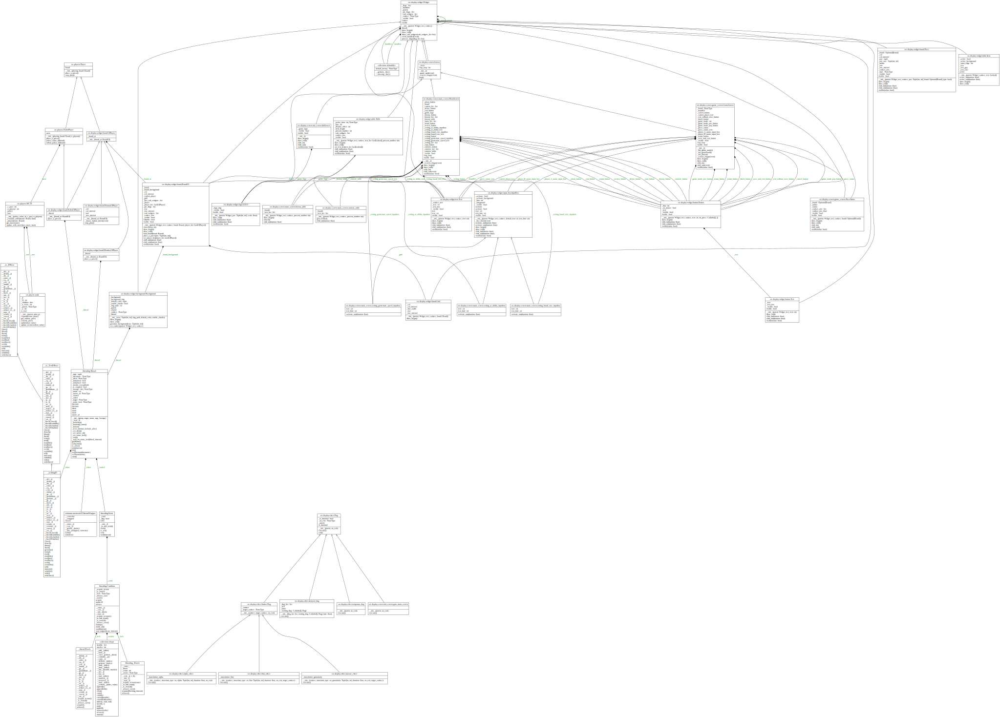

# pyGobang 项目报告

作者：Jesse Senior

## 0 项目简述

项目名：pyGobang
项目目标：基于 python 实现一个精致的五子棋小游戏。

具体而言，项目需要满足以下要求：

1. 支持双人对战、人机对战
2. 记录对战记录
3. 友好的交互界面

## 1 项目规划

### 1.0 技术栈

游戏使用 pygame 作为图形引擎，利用 sqlite 记录历史棋局。

游戏目前使用蒙特卡洛搜索树(MCTS)实现人机对战部分，之后会择机优化。

### 1.1 模块功能规划

| 模块名    | 功能                                                           |
| :-------- | :------------------------------------------------------------- |
| constants | 游戏常量部分。                                                 |
| core      | 游戏核心代码部分，包含棋盘类的定义以及胜负局面的逻辑判断。     |
| database  | 数据库交互部分，负责历史棋局的维护。                           |
| players   | 人机交互部分，负责双人对战、人机对战的逻辑抽象以及 AI 的实现。 |
| main      | 游戏主函数，负责游戏界面初始化、切换、退出以及启动消息循环。   |
| display   | GUI 部分，包含棋盘、棋子的绘制以及消息传递。                   |
| - tool    | GUI 其他实用函数，比如图像格式转换。                           |
| - texture | GUI 纹理模块，负责背景纹理生成。                               |
| - effect  | GUI 效果模块，负责界面动画效果具体实现。                       |
| - widget  | GUI 组件。                                                     |
| - screen  | GUI 主要界面。                                                 |

### 1.2 游戏界面规划

```mermaid
flowchart TD
    start_(游戏启动)
    subgraph main_screen [主界面]
    history_game[历史对战]
    start_game[开始游戏]
    statistic_info[统计信息]
    game_settings[游戏设置]
    about_us[关于我们]
    exit[退出游戏]
    end
    game_screen[游戏界面]
    end_(游戏退出)

    start_--初始化--> main_screen
    start_game --开始游戏--> game_screen
    history_game --恢复游戏--> game_screen
    game_screen --游戏结束--> main_screen
    exit --> end_
```

### 1.3 GUI 底层规划

由于 pygame 本身并未提供类似于 MFC 或是 Qt 的顶层模块，所以类似于按钮、输入框、文本框、列表等组件需要自主设计。

为了保证项目的易维护性和易扩展性，GUI 部分将以面向对象的方式来设计，如图所示😉

### 1.4 人机对抗算法规划

原始代码参考：<https://github.com/junxiaosong/AlphaZero_Gomoku>

原始项目库主要面向训练 AlphaZero 算法，本项目最初准备使用 AlphaZero 算法，但由于考虑到棋盘规模限制以及算力要求，最终决定退而求其次，使用 MCTS 算法。以下判断依据：

> **Tips for training:**
>
> 1. It is good to start with a 6 \* 6 board and 4 in a row. For this case, we may obtain a reasonably good model within 500~1000 self-play games in about 2 hours.
> 2. For the case of 8 \* 8 board and 5 in a row, it may need 2000~3000 self-play games to get a good model, and it may take about 2 days on a single PC.
>
> _Reference: <https://github.com/junxiaosong/AlphaZero_Gomoku#getting-started>_

MCTS 基于标准的博弈树，但不同于常见的极小化极大算法，MCTS 能够在对深层次变型的利用和对少数模拟移动的探索这二者中保持某种平衡，因此在相同算力下棋力比朴素的极小化极大算法更高。

蒙特卡洛树搜索的每个循环包括四个步骤：

- 选择（Selection）：从根节点 R 开始，连续向下选择子节点至叶子节点 L。下文将给出一种选择子节点的方法，让游戏树向最优的方向扩展，这是蒙特卡洛树搜索的精要所在。
- 扩展（Expansion）：除非任意一方的输赢使得游戏在 L 结束，否则创建一个或多个子节点并选取其中一个节点 C。
- 仿真（Simulation）：在从节点 C 开始，用随机策略进行游戏，又称为 playout 或者 rollout。
- 反向传播（Backpropagation）：使用随机游戏的结果，更新从 C 到 R 的路径上的节点信息。

重复足够多次数的循环后，即可得到比较好的策略。

### 1.5 外部依赖模块规划

| 模块名      | 用途                 |
| ----------- | -------------------- |
| pygame      | 主要的图形界面 API   |
| numpy       | 快速存储棋盘信息     |
| pillow      | 背景纹理效果处理     |
| pyinstaller | 项目打包为二进制文件 |
| sqlite      | 数据库交互           |
| pickle      | 棋盘二进制数据编解码 |

## 2 项目进展

- [x] 核心部分代码。
- [x] 数据库交互代码。
- [x] 人机对抗代码。
- [ ] 修复**全部**BUG（开玩笑，修的差不多了啦 w(ﾟ Д ﾟ)w
- 图形界面部分：
  - [x] 人人对战、人机对战。
  - [x] 历史记录查询、恢复、删除。
  - [x] 统计信息。
  - [x] 游戏设置。
  - [x] 游戏音效、背景音乐。
  - [ ] 游戏动画效果。
